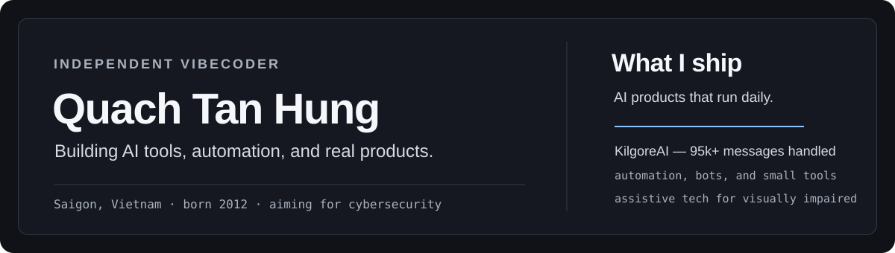

<div align="center">



</div>

<h1 align="center">Quách Tấn Hưng</h1>

<p align="center">
  <samp>FREELANCE VIBECODER / AI TOOLS / AUTOMATION</samp>
</p>

<p align="center">
  Freelance vibecoder from Saigon, born 2012.
  I vibecode tools, automation, and AI products — and I'm working toward a career in cybersecurity.
</p>

---

<table>
  <tr>
    <td width="60%" valign="top">
      <h2>Projects</h2>
      <h3>KilgoreAI</h3>
      <p>
        AI assistant for everyday work — over 95,000 messages processed
        (as of September 2026). Self-hosted, always running.
      </p>
      <p>
        <a href="https://kilgoreai.xyz">Live website</a>
      </p>
      <h3>Artificial Eyes</h3>
      <p>
        A chest-worn AI assistant for visually impaired people.
        Mobile app, AI, and embedded hardware in one product.
      </p>
      <p>
        <a href="https://artificialeyes.ddns.net/">Live website</a>
        &nbsp;/&nbsp;
        <a href="https://github.com/Hungvip69/artificial-eyes">Source repository</a>
      </p>
    </td>
    <td width="40%" valign="top">

```txt
PROFILE

name      Quach Tan Hung
role      freelance vibecoder
location  Saigon, Vietnam
born      2012
goal      cybersecurity
language  Vietnamese, English
```

  </td>
  </tr>
</table>

## Awards

| Award | Event | Year |
|---|---|---|
| Second Prize, Secondary School Division | Codeavour 6.0 Vietnam | 2025 |
| International finals participant | Codeavour 6.0, Qatar | 2025 |
| Third Prize, System Software | HCMC Science & Engineering Contest | 2026 |
| Consolation Prize, Creative Products (D2) | HCMC Young Informatics Contest, 35th | 2026 |

## Tools

`JavaScript` `TypeScript` `React` `Node.js` `Python` `HTML` `CSS` `Git`

## Contact

- Website: [hungw.id.vn](https://hungw.id.vn)
- Email: [contact@hungw.id.vn](mailto:contact@hungw.id.vn)
- Telegram: [@Quachtanhung](https://t.me/Quachtanhung)

---

<p align="center">
  <samp>ship fast / automate everything / aim for security</samp>
</p>
